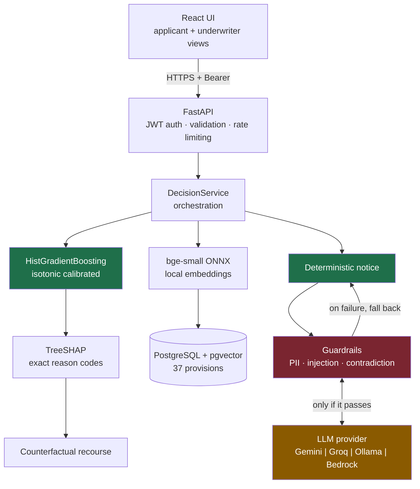

# Pratyaya — Explainable Credit Risk for Thin-File Borrowers

> *Pratyaya* (प्रत्यय), Sanskrit for trust or conviction. The English word *credit*
> descends from the Latin *credere* — to believe. Both name the same thing: a
> lender's belief that a borrower will repay. For 
> someone with no credit history, the problem is not that the belief is
> misplaced. It is that nobody has ever looked.

Submission for the Synchrony Hackathon — **Problem Statement 2: AI-Powered
Financial Inclusion, Dynamic Risk Assessment for Underserved Segments.**

---

## The problem

Conventional underwriting reads a credit bureau file. An applicant who has
never borrowed formally has no file, so the model has nothing to read. They are
declined not for being risky but for being *unobserved* — and because they are
declined, they never generate the history that would let them be observed next
time. The exclusion is self-sealing.

In this project's reference population, **59% of applicants are new-to-credit**,
and they are not evenly distributed: women are new-to-credit 70.6% of the time
against 51.0% for men, rural applicants 67.5% against 51.8% in metros. A model
leaning on bureau data inherits that skew wholesale.

## The core design decision

**The language model sits on the explanation path, never the decision path.**

```
application ──► deterministic model ──► DECISION (final)
                        │
                        ├──► TreeSHAP ──────► reason codes
                        ├──► counterfactuals ► recourse
                        └──► pgvector ───────► cited provisions
                                                    │
                                                    ▼
                                        deterministic notice (complete, compliant)
                                                    │
                                                    ▼
                                      LLM rewrites it more warmly ──► guardrail
                                                                          │
                                                              pass ◄──────┴──────► fail
                                                                │                   │
                                                                ▼                   ▼
                                                          generated text    deterministic notice
```

A hallucination, a provider outage, an exhausted quota or a change of vendor can
alter how a decision is *described*. None of them can alter what the decision
*is*, which factors drove it, or which rules were cited. By the time any model
is called, a complete and compliant answer already exists.

This is why the system remains correct with no API key configured at all.

## Headline result

Two models, identical data and splits, approval rate held constant at 70%. One
sees only the traditional bureau record; the other also sees consented
alternative data — UPI cash flow, utility punctuality, telecom tenure.

| | Bureau only | + Alternative data | Change |
|---|---|---|---|
| ROC AUC | 0.7314 | **0.7797** | +0.048 |
| KS | 0.3365 | **0.4127** | +0.076 |
| Bad rate among approved | 0.0746 | **0.0623** | −0.012 |
| Creditworthy NTC approved | 0.7189 | **0.7361** | +0.017 |
| Disparate impact (gender) | 0.869 | **0.964** | +0.095 |
| **Qualified-approval gap** | **0.1083** | **0.0341** | **−0.074** |

Stated as people rather than metrics — among applicants who **would have repaid**:

| | Bureau only | + Alternative data |
|---|---|---|
| Women approved | 70.9% | **75.5%** |
| Men approved | 81.7% | 78.9% |
| Gap | **10.8 points** | **3.4 points** |

Bureau-only underwriting imposed a **10.8-point penalty on creditworthy women**.
Alternative data cuts that to 3.4 points — a 69% reduction — while *also*
raising AUC and *lowering* the bad rate among approved.

There is no accuracy-versus-fairness trade-off here. Accuracy, risk and equity
move together, because the bias was never a property of the algorithm. It was a
property of the *evidence*, and the remedy is better evidence.

**Why this result is meaningful:** in the generated population, true default
rates are equal across gender (0.118 vs 0.122) and region. Repayment depends
only on latent capacity and willingness — there is no gender or region term.
So every point of approval gap is unjustified by risk. That is asserted as a
test, not assumed.

## Architecture



Green components are load-bearing: the decision and the compliant notice depend
only on them. The amber component is optional and can fail without consequence.

### Layer map

| Brief's layer | Built as | Note |
|---|---|---|
| Frontend | React + Vite | |
| Backend | **FastAPI** | The brief permits "Spring Boot **or equivalent**". Same layered shape: router → service → repository, DTOs as Pydantic models, OpenAPI generated. |
| Database | PostgreSQL + pgvector | Falls back to in-memory search when no database is reachable; `/health` reports which is live. |
| AI | Provider abstraction | Gemini, Groq, Ollama, Bedrock behind one interface, selected by `LLM_PROVIDER`. Moving to Bedrock is an env var and an IAM role. |
| Embeddings | bge-small-en-v1.5 via ONNX | Runs locally. No text leaves the machine, no per-query cost, deterministic vectors so an audited retrieval is reproducible. |
| Security | JWT, role scoping, validation, rate limiting | No secret has a default; a placeholder `JWT_SECRET` fails startup. |

## Setup

Requires **Python 3.12+** and [uv](https://docs.astral.sh/uv/). No Docker, no
Homebrew, and no compiled system libraries are needed — the project deliberately
avoids LightGBM and XGBoost because both dynamically link `libomp` on macOS,
which breaks installation on a machine without Homebrew.

```bash
git clone <repository-url> && cd pratyaya

uv venv --python 3.12
uv pip install -e ".[dev]"

cp .env.example .env
python -c "import secrets; print(secrets.token_urlsafe(48))"   # paste into JWT_SECRET

python scripts/train.py            # trains both models, writes ml/artifacts/
uvicorn backend.app.main:app --reload
```

Open <http://localhost:8000/docs> for the generated OpenAPI documentation.

**An LLM API key is optional.** With `GEMINI_API_KEY` or `GROQ_API_KEY` set, the
narrative is generated and guardrailed. Without one, every endpoint still returns
a complete decision with reasons, recourse and citations — the `provenance`
block on each response says which path produced the wording.

### Running the tests

```bash
pytest                                            # 103 tests
pytest --cov=backend/app --cov=ml --cov-report=term   # 89% coverage
```

## Project layout

```
backend/app/
  api/v1/routers/   HTTP endpoints
  core/             configuration, security
  llm/              provider abstraction, prompts, guardrails
  rag/              corpus parsing, embeddings, vector stores
  repositories/     data access
  schemas/          request and response contracts
  services/         orchestration, notice rendering
ml/
  data/             population generator
  training/         design matrix, training pipeline
  explain/          reason codes, recourse, feature dictionary
  fairness/         disparate impact and qualified-approval audit
data/policy/        regulatory corpus (paraphrased, cited)
eval/               evaluation harness and reports
```

## Responsible AI

**Protected attributes never reach the model.** Gender, region and age band are
excluded structurally in `feature_columns()`, not dropped later, and a test
asserts they cannot appear in a reason code.

**Mitigation must not require the protected attribute at decision time.**
Fairlearn's `ThresholdOptimizer` reaches parity by applying a different
threshold per group. Statistically effective; in lending it means an applicant's
gender changes the bar they must clear, which is direct discrimination rather
than a cure for it. Two applicants with identical financial records receive an
identical decision here.

**Recourse is constrained to be honest.** Only factors the applicant can
actually move are offered — never age, education or employment sector. Targets
are capped at the 85th percentile of the observed population, so the system
never advises someone to reach a balance only the top few percent maintain. When
no attainable change would flip the decision, that is reported rather than
padded with an impossible suggestion.

**Signals deliberately not collected.** Social graphs, contact lists, SMS
content, app-usage timing, and caste or religion proxies are not generated,
stored or modelled. Some are predictive. The RBI Digital Lending Directions
restrict collection to what is need-based and the DPDP Act requires purpose
limitation, and excluding them at source is a stronger guarantee than collecting
them and promising restraint.

**No personal data reaches a third-party model.** The prompt is assembled only
from the decision object — never from the applicant record. There is no code
path by which a name, PAN, Aadhaar or phone number could be sent to a provider,
and the API rejects requests carrying such fields with a 422.

## Honest limitations

**The population is synthetic.** No public dataset joins Account
Aggregator-style alternative data to realised loan outcomes for Indian
borrowers; that data is personal financial information and is not published.
The generator is therefore explicit, seeded and documented in
`ml/data/generator.py`, with its causal structure and its two deliberate bias
mechanisms stated openly. Absolute figures describe this population, not the
Indian credit market. The *direction* of the result — that alternative data
improves accuracy and fairness together — follows from a mechanism (bureau
absence correlates with gender and region while true risk does not) that is
well documented in the real world.

**The regulatory corpus is paraphrased, not verbatim.** Every provision is a
plain-language summary carrying a citation to the real instrument, clearly
labelled in `data/policy/README.md`. Seeding a retrieval corpus with invented
quotations would commit precisely the hallucination this architecture exists to
prevent. Production would ingest the official texts; nothing else changes.

**The Bedrock adapter has never run against a live endpoint.** It is written to
the Converse API and wired into the same factory as every other provider, but
this project was built without AWS access. It is included to show that the
abstraction holds, and its test coverage is correspondingly low.

**No live deployment.** The cloud layer is designed, not provisioned.

## What I would do next

1. Replace the synthetic population with a real portfolio and re-run the
   inclusion experiment. The finding is a hypothesis with supporting evidence,
   not a measurement of the Indian market.
2. Ingest official regulatory texts with per-clause identifiers and effective
   dates, so citations carry versions.
3. Monitor for drift in the alternative-data features, which move faster than
   bureau data — a UPI behaviour distribution can shift within a quarter.
4. Champion/challenger against a WOE scorecard, the format Indian credit teams
   actually review and sign off.
5. Reject inference. The model only observes repayment for applicants who were
   approved, so the training population is censored by past policy.
