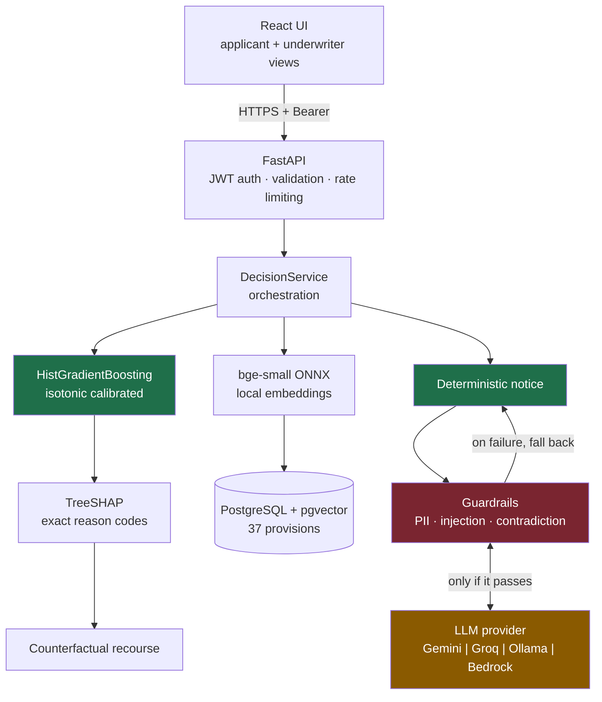
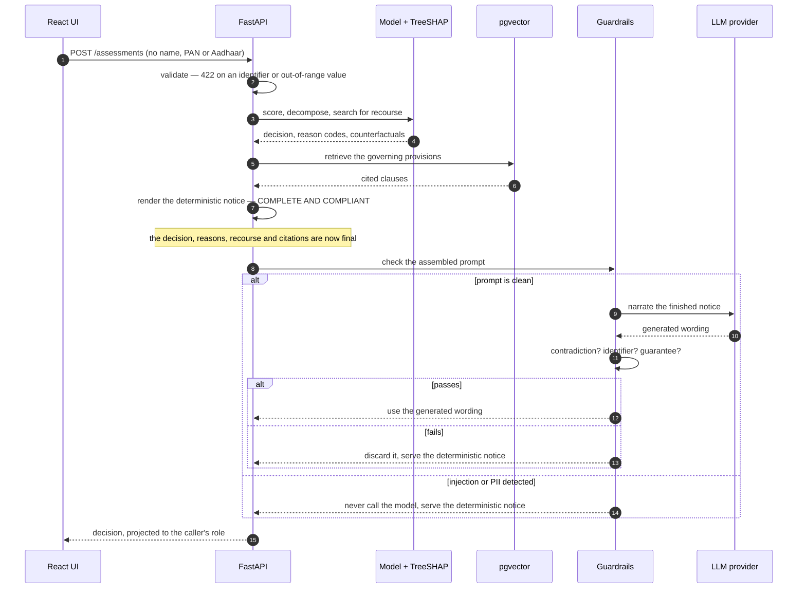
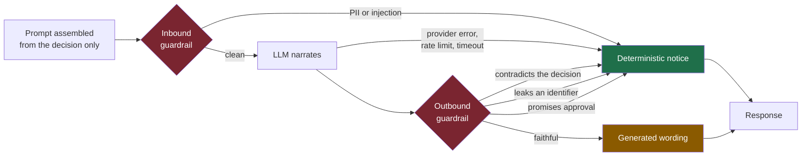

# Pratyaya — Explainable Credit Risk for Thin-File Borrowers

> *Pratyaya* (प्रत्यय), Sanskrit for trust or conviction. The English word *credit*
> descends from the Latin *credere* — to believe. Both name the same thing: a
> lender's belief that a borrower will repay. For 
> someone with no credit history, the problem is not that the belief is
> misplaced. It is that nobody has ever looked.

Submission for the Synchrony Hackathon — **Problem Statement 2: AI-Powered
Financial Inclusion, Dynamic Risk Assessment for Underserved Segments.**

---

## The problem

Conventional underwriting reads a credit bureau file. An applicant who has
never borrowed formally has no file, so the model has nothing to read. They are
declined not for being risky but for being *unobserved* — and because they are
declined, they never generate the history that would let them be observed next
time. The exclusion is self-sealing.

In this project's reference population, **59% of applicants are new-to-credit**,
and they are not evenly distributed: women are new-to-credit 70.6% of the time
against 51.0% for men, rural applicants 67.5% against 51.8% in metros. A model
leaning on bureau data inherits that skew wholesale.

## The core design decision

**The language model sits on the explanation path, never the decision path.**

```
application ──► deterministic model ──► DECISION (final)
                        │
                        ├──► TreeSHAP ──────► reason codes
                        ├──► counterfactuals ► recourse
                        └──► pgvector ───────► cited provisions
                                                    │
                                                    ▼
                                        deterministic notice (complete, compliant)
                                                    │
                                                    ▼
                                      LLM rewrites it more warmly ──► guardrail
                                                                          │
                                                              pass ◄──────┴──────► fail
                                                                │                   │
                                                                ▼                   ▼
                                                          generated text    deterministic notice
```

A hallucination, a provider outage, an exhausted quota or a change of vendor can
alter how a decision is *described*. None of them can alter what the decision
*is*, which factors drove it, or which rules were cited. By the time any model
is called, a complete and compliant answer already exists.

This is why the system remains correct with no API key configured at all.

## Headline result

Two models, identical data and splits, approval rate held constant at 70%. One
sees only the traditional bureau record; the other also sees consented
alternative data — UPI cash flow, utility punctuality, telecom tenure.

| | Bureau only | + Alternative data | Change |
|---|---|---|---|
| ROC AUC | 0.7314 | **0.7797** | +0.048 |
| KS | 0.3365 | **0.4127** | +0.076 |
| Bad rate among approved | 0.0746 | **0.0623** | −0.012 |
| Creditworthy NTC approved | 0.7189 | **0.7361** | +0.017 |
| Disparate impact (gender) | 0.869 | **0.964** | +0.095 |
| **Qualified-approval gap** | **0.1083** | **0.0341** | **−0.074** |

Stated as people rather than metrics — among applicants who **would have repaid**:

| | Bureau only | + Alternative data |
|---|---|---|
| Women approved | 70.9% | **75.5%** |
| Men approved | 81.7% | 78.9% |
| Gap | **10.8 points** | **3.4 points** |

Bureau-only underwriting imposed a **10.8-point penalty on creditworthy women**.
Alternative data cuts that to 3.4 points — a 69% reduction — while *also*
raising AUC and *lowering* the bad rate among approved.

There is no accuracy-versus-fairness trade-off here. Accuracy, risk and equity
move together, because the bias was never a property of the algorithm. It was a
property of the *evidence*, and the remedy is better evidence.

**Why this result is meaningful:** in the generated population, true default
rates are equal across gender (0.118 vs 0.122) and region. Repayment depends
only on latent capacity and willingness — there is no gender or region term.
So every point of approval gap is unjustified by risk. That is asserted as a
test, not assumed.

## Is this just an artefact of synthetic data?

The fair objection to a generated population is that the result could be an
artefact of the generator. So the *identical* code path — design matrix,
booster, isotonic calibration, exact TreeSHAP, fairness audit — was run over two
real public credit datasets with genuinely observed defaults.

| | Rows | AUC | KS | Calibration error | TreeSHAP additivity |
|---|---|---|---|---|---|
| German Credit (Statlog) | 1,000 | 0.7464 | 0.3752 | 0.0772 | 2.7e-15 |
| Taiwan Default of Credit Card Clients | 30,000 | 0.7829 | 0.4391 | 0.0222 | 4.0e-15 |
| **This project, synthetic** | 30,000 | **0.7797** | **0.4127** | **0.0073** | **5.2e-15** |

The synthetic population's difficulty sits **between** the two real datasets,
which is the answer to "you tuned it to a flattering level". TreeSHAP stays
exact on real data, and the audit found a genuine violation rather than
rubber-stamping: age band on German Credit fails the 80% rule at 0.783.

**What this does not establish.** Neither dataset carries alternative data, so
the traditional-versus-inclusive comparison cannot be reproduced on them. That
finding rests on the synthetic population. `python scripts/validate_on_real_data.py`

## Did the standard algorithmic fixes work?

Claiming the disparity lives in the evidence is only worth something if the
algorithmic remedies were actually tried. All measured at the same approval rate:

| Strategy | AUC | Bad rate | Disparate impact | Reads gender to decide? |
|---|---|---|---|---|
| Baseline, bureau only | 0.731 | 0.0698 | 0.879 | no |
| **Alternative data (this project)** | **0.765** | **0.0616** | 0.957 | **no** |
| CorrelationRemover | 0.727 | 0.0708 | 0.990 | **yes** |
| ThresholdOptimizer | 0.677 | 0.1200 | 1.000 | **yes** |
| ExponentiatedGradient | *degenerate* | 0.1191 | 0.996 | no |

Every algorithmic remedy bought fairness with accuracy or with risk. Widening
the evidence was the only one that improved all three together, and the only
one needing the protected attribute at neither training nor decision time.

Two failures worth recording rather than smoothing over. `CorrelationRemover`
cannot accept `NaN`, so the missing bureau records had to be imputed before it
would run — in thin-file lending that absence *is* the signal.
`ExponentiatedGradient` collapsed to approving ~99% of applicants across five
constraint tightnesses and all three constraint types tried: at a 12% base rate,
approving everyone satisfies parity exactly while being only 12% wrong.
`python scripts/compare_mitigations.py`

## Does the language model actually hold up?

It runs live against Gemini. Measured over ten consecutive calls through the
HTTP API on `gemini-3.1-flash-lite`: **ten narrated successfully, no fallbacks,
2.8 s mean**.

Getting there surfaced three things mocks would never have shown:

1. **Pinned models retire.** `gemini-2.0-flash` returns 404; several 2.5-series
   identifiers are closed to new accounts. The provider abstraction made that a
   one-line change, which is the argument for having it. The audit trail now
   records the version the API *resolved*, not the one we asked for.
2. **Gemini 3 spends tokens thinking before answering**, drawn from the same
   output budget, and at a small budget returns empty text with
   `finishReason: MAX_TOKENS`. Thinking is disabled — the decision and its
   reasons are settled before the model is called — and an empty completion now
   raises so the applicant gets the deterministic notice, never a blank reason.
3. **Model choice is an empirical question.** The first model that worked fell
   back half the time under load at 8 s mean. Benchmarking what the key could
   actually reach found one that is 3× faster and did not fail once.

**The most useful measurement was the failure.** On the first model, 5 of 10
requests lost their generated wording to rate limits and 503s — and every one of
those still returned the correct decision, reasons, recourse and citations. That
is the architecture doing exactly what it was built to do, observed rather than
asserted. `python scripts/demo_guardrails.py`

## Do the guardrails survive an adversary?

Partly, and the measurement is more useful than the number. The hand-written
evaluation scores F1 1.000 — on 23 cases written by the same person who wrote
the guardrails. Red-teaming them with a model asked to invent attacks it was
never shown, and not told what the detectors look for:

| Round | Recall | Precision |
|---|---|---|
| 1, original guardrails | 0.450 | 1.000 |
| 2, after hardening | 0.650 | 1.000 |
| 3, after further hardening | **0.600** | 1.000 |

**Recall plateaus near 0.6.** Each patch catches that round's phrasings; the next
round finds new ones. By round three the misses were different *categories* —
instructions about tone, unrelated false claims — not variants of what was
defended. Pattern matching is an arms race a regex does not win.

That is survivable for one reason, and it is the architecture rather than the
detector: **a missed contradiction cannot produce a wrong decision.** The worst
case is bad wording attached to a correct decision, correct reason codes and
correct citations. And the apparent personal-data leaks are the model
*fabricating* identifiers — none ever enters the prompt — so they are wrong, but
they are not disclosure.

Precision stayed 1.000 throughout: no faithful explanation was ever blocked,
which matters as much, since suppressing legitimate explanations breaks the duty
to give reasons. `python scripts/redteam_guardrails.py`

## What it costs to explain a decision

Per applicant, on CPU, p50:

| Stage | p50 | p95 |
|---|---|---|
| Score only | 3.18 ms | 4.34 ms |
| **Score + exact SHAP reason codes** | **3.52 ms** | 4.55 ms |
| Retrieve governing provisions | 2.93 ms | 3.17 ms |
| Render the full compliant notice | 3.68 ms | 4.82 ms |
| Search for actionable recourse | 75.92 ms | 92.14 ms |

**Exact reason codes cost 0.34 ms.** A complete, explained, cited decision lands
in about 10 ms — about 86 ms when it also computes recourse. Explainability is
not something this lender trades latency for. The language model is excluded: it
is off the decision path and its latency belongs to a third party.
`python scripts/benchmark_latency.py`

## Architecture



Green components are load-bearing: the decision and the compliant notice depend
only on them. The amber component is optional and can fail without consequence.

### What happens when an application arrives



Every path through that diagram ends with the applicant holding a correct,
complete, cited decision. The only thing that varies is who wrote the sentences.

### Where a guardrail can intervene



Measured on a flaky free tier, five of ten requests took a red path. Every one
of them still returned the correct decision, reasons, recourse and citations.

### Layer map

| Brief's layer | Built as | Note |
|---|---|---|
| Frontend | React + Vite | |
| Backend | **FastAPI** | The brief permits "Spring Boot **or equivalent**". Same layered shape: router → service → repository, DTOs as Pydantic models, OpenAPI generated. |
| Database | PostgreSQL + pgvector | Falls back to in-memory search when no database is reachable; `/health` reports which is live. |
| AI | Provider abstraction | Gemini, Groq, Ollama, Bedrock behind one interface, selected by `LLM_PROVIDER`. Moving to Bedrock is an env var and an IAM role. |
| Embeddings | bge-small-en-v1.5 via ONNX | Runs locally. No text leaves the machine, no per-query cost, deterministic vectors so an audited retrieval is reproducible. |
| Security | JWT, role scoping, validation, rate limiting | No secret has a default; a placeholder `JWT_SECRET` fails startup. |

## Setup

Requires **Python 3.12+** and [uv](https://docs.astral.sh/uv/). No Docker, no
Homebrew, and no compiled system libraries are needed — the project deliberately
avoids LightGBM and XGBoost because both dynamically link `libomp` on macOS,
which breaks installation on a machine without Homebrew.

### 1. The API

```bash
git clone https://github.com/Nishantttt-ui/pratyaya.git && cd pratyaya

# with uv (fast), or use the plain-pip lines beneath
uv venv --python 3.12 && source .venv/bin/activate
uv pip install -e ".[dev]"

# or, without uv:
#   python3.12 -m venv .venv && source .venv/bin/activate
#   pip install -e ".[dev]"

cp .env.example .env
python -c "import secrets; print(secrets.token_urlsafe(48))"   # paste into JWT_SECRET
#   DATABASE_URL is optional: with none reachable, retrieval falls back to an
#   in-memory store and /health reports which path is live.

python scripts/train.py                                # trains both models
uvicorn backend.app.main:app --reload --port 8000
```

Open <http://localhost:8000/docs> for the generated OpenAPI documentation, or
<http://localhost:8000/health> to see which components came up.

### 2. The interface

```bash
cd frontend
npm install
cp .env.example .env          # VITE_API_BASE defaults to http://localhost:8000
npm run dev                   # http://localhost:5173
```

Sign in with the demo accounts — `underwriter` and `applicant` — using the
passwords you set in the API's `.env`. If you left them unset, a random one is
generated per run and printed once to the API console.

The two roles are the point: both see the same decision, the same reasons and
the same recourse, but the probability, the threshold, the signed contributions
and the provenance block are absent from the applicant response entirely.

### 3. Optional: a real database and a real model

```bash
# PostgreSQL with pgvector (Neon's free tier works; any Postgres 15+ will do)
#   set DATABASE_URL in .env, then:
python scripts/index_policy_corpus.py     # indexes the corpus and verifies it
                                          # returns the same results as in-memory

# a language model for the narration layer (optional; Gemini or Groq free tier)
#   set GEMINI_API_KEY or GROQ_API_KEY, then:
python scripts/demo_guardrails.py         # five guardrail scenarios, live
```

**An LLM API key is optional.** With `GEMINI_API_KEY` or `GROQ_API_KEY` set, the
narrative is generated and guardrailed. Without one, every endpoint still returns
a complete decision with reasons, recourse and citations — the `provenance`
block on each response says which path produced the wording.

### Everything you can run

```bash
pytest                                       # 133 tests
pytest --cov=backend/app --cov=ml            # coverage report
ruff check backend ml eval scripts           # lint

python scripts/train.py                      # train both models, write artifacts
python eval/run_eval.py                      # retrieval, guardrails, faithfulness, calibration
python scripts/validate_on_real_data.py      # the same pipeline on two real datasets
python scripts/replicate_inclusion_on_real_data.py   # the finding, tested on real defaults
python scripts/compare_mitigations.py        # against Fairlearn's algorithmic remedies
python scripts/reject_inference_experiment.py        # what past policy hides, and recovery
python scripts/benchmark_latency.py          # per-stage decision latency
python scripts/index_policy_corpus.py        # index into pgvector and verify  (needs a DB)
python scripts/demo_guardrails.py            # five guardrail scenarios        (needs a key)
python scripts/redteam_guardrails.py         # attacks invented by a model     (needs a key)
python scripts/make_figures.py               # the ten charts in the deck
node scripts/deck/build_deck.js              # rebuild the deck itself
```

Every number quoted in this README and in the deck is produced by one of these
and written to `eval/reports/`, so neither can drift from the model.

### Further reading

- **[MODEL_CARD.md](MODEL_CARD.md)** — intended use, out-of-scope uses, the
  groups measured and the ones that were not, and six caveats headed by "do not
  deploy this model".
- **[data/policy/README.md](data/policy/README.md)** — provenance and limits of
  the regulatory corpus.

## Project layout

```
backend/app/
  api/v1/routers/   HTTP endpoints
  core/             configuration, security
  llm/              provider abstraction, prompts, guardrails
  rag/              corpus parsing, embeddings, vector stores
  repositories/     data access
  schemas/          request and response contracts
  services/         orchestration, notice rendering
ml/
  data/             population generator
  training/         design matrix, training pipeline
  explain/          reason codes, recourse, feature dictionary
  fairness/         disparate impact and qualified-approval audit
data/policy/        regulatory corpus (paraphrased, cited)
eval/               evaluation harness and reports
```

## Responsible AI

**Protected attributes never reach the model.** Gender, region and age band are
excluded structurally in `feature_columns()`, not dropped later, and a test
asserts they cannot appear in a reason code.

**Mitigation must not require the protected attribute at decision time.**
Fairlearn's `ThresholdOptimizer` reaches parity by applying a different
threshold per group. Statistically effective; in lending it means an applicant's
gender changes the bar they must clear, which is direct discrimination rather
than a cure for it. Two applicants with identical financial records receive an
identical decision here.

**Recourse is constrained to be honest.** Only factors the applicant can
actually move are offered — never age, education or employment sector. Targets
are capped at the 85th percentile of the observed population, so the system
never advises someone to reach a balance only the top few percent maintain. When
no attainable change would flip the decision, that is reported rather than
padded with an impossible suggestion.

**Signals deliberately not collected.** Social graphs, contact lists, SMS
content, app-usage timing, and caste or religion proxies are not generated,
stored or modelled. Some are predictive. The RBI Digital Lending Directions
restrict collection to what is need-based and the DPDP Act requires purpose
limitation, and excluding them at source is a stronger guarantee than collecting
them and promising restraint.

**No personal data reaches a third-party model.** The prompt is assembled only
from the decision object — never from the applicant record. There is no code
path by which a name, PAN, Aadhaar or phone number could be sent to a provider,
and the API rejects requests carrying such fields with a 422.

## Honest limitations

**The population is synthetic.** No public dataset joins Account
Aggregator-style alternative data to realised loan outcomes for Indian
borrowers; that data is personal financial information and is not published.
The generator is therefore explicit, seeded and documented in
`ml/data/generator.py`, with its causal structure and its two deliberate bias
mechanisms stated openly. Absolute figures describe this population, not the
Indian credit market. The *direction* of the result — that alternative data
improves accuracy and fairness together — follows from a mechanism (bureau
absence correlates with gender and region while true risk does not) that is
well documented in the real world.

**The regulatory corpus is paraphrased, not verbatim.** Every provision is a
plain-language summary carrying a citation to the real instrument, clearly
labelled in `data/policy/README.md`. Seeding a retrieval corpus with invented
quotations would commit precisely the hallucination this architecture exists to
prevent. Production would ingest the official texts; nothing else changes.

**The Bedrock adapter has never run against a live endpoint.** It is written to
the Converse API and wired into the same factory as every other provider, but
this project was built without AWS access. It is included to show that the
abstraction holds, and its test coverage is correspondingly low.

**No live deployment.** The cloud layer is designed, not provisioned.

## What I would do next

1. Replace the synthetic population with a real portfolio and re-run the
   inclusion experiment. The finding is a hypothesis with supporting evidence,
   not a measurement of the Indian market.
2. Ingest official regulatory texts with per-clause identifiers and effective
   dates, so citations carry versions.
3. Monitor for drift in the alternative-data features, which move faster than
   bureau data — a UPI behaviour distribution can shift within a quarter.
4. Champion/challenger against a WOE scorecard, the format Indian credit teams
   actually review and sign off.
5. Reject inference. The model only observes repayment for applicants who were
   approved, so the training population is censored by past policy.
